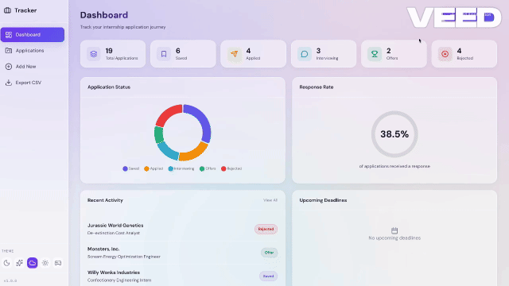

# Internship Application Tracker

A modern web application to track and manage your internship and job applications. Built with Flask and designed for productivity.


## Demo

### Dashboard


### Adding an Application


### Theme Switching


## Features

### Core Features
- **Application Management**: Add, edit, view, and delete applications
- **Position Tracking**: Store job title, company, position level, and location
- **Requirements Tracking**: Keep track of skills and qualifications needed
- **Network Contacts**: Save people to connect with for each opportunity
- **Update Log**: Add timestamped updates as your application progresses
- **Status Workflow**: Track status (Saved → Applied → Interviewing → Offer/Rejected)

### Additional Features
- **Dashboard Analytics**: Visual charts showing application statistics
- **Search & Filter**: Find applications by company, status, or keywords
- **Deadline Tracking**: Never miss an application deadline
- **Tags**: Categorize applications (Remote, Hybrid, On-site, Industry)
- **Export to CSV**: Download your data for backup or analysis
- **Responsive Design**: Works on desktop and mobile

## Quick Start

### Prerequisites
- Python 3.8 or higher
- pip (Python package manager)
- Git

### Installation

**1. Clone the repository**
```bash
git clone https://github.com/yegungor/internship-tracker.git
cd ~/Downloads/internship-tracker       # Change this to wherever you downloaded/extracted the project
```

**2. Run the setup script**

Mac/Linux:
```bash
chmod +x setup.sh    # Make it executable (first time only)
./setup.sh
```

Windows:
```bash
setup.bat
```

**3. Start the app**

Mac/Linux:
```bash
./run.sh
```

Windows:
```bash
run.bat
```

**4. Open your browser**
```
http://127.0.0.1:1453
```

## Project Structure

```
internship-tracker/
├── setup.sh                   # Script
├── run.sh                     # Script
├── setup.bat                  # Script
├── run.bat                    # Script
├── app.py                     # Main Flask application
├── models.py                  # Database models
├── requirements.txt           # Python dependencies
├── README.md                  # This file
├── .gitignore                 # Git ignore rules
├── LICENSE                    # MIT License
├── instance/
│   └── tracker.db             # SQLite database (auto-created)
├── static/
│   ├── css/
│   │   ├── style-default.css          # Active theme (rename to switch)
│   │   ├── style-glass.css    # Glassmorphism theme
│   │   ├── style-minimal.css  # Minimalist light theme
│   │   └── style-retro.css    # Retro pixel theme
│   └── js/
│       └── main.js            # Frontend JavaScript
└── templates/
    ├── base.html              # Base template
    ├── index.html             # Dashboard
    ├── applications.html      # All applications view
    ├── add.html               # Add new application
    ├── edit.html              # Edit application
    └── view.html              # Single application view
```

## Usage

### Adding an Application
1. Click "Add Application" from the dashboard
2. Fill in the company, position, and requirements
3. Add contacts you want to network with
4. Set the status and any deadlines
5. Save and track your progress

### Updating Progress
1. Open any application
2. Use the "Add Update" section to log new developments
3. Updates are timestamped automatically
4. Change status as you progress through the pipeline

### Filtering & Search
- Use the search bar to find applications by company or title
- Filter by status using the dropdown
- Sort by date, company, or deadline

### Switching Themes
Click the theme buttons in the sidebar to change the look:
- **Dark** — Default purple dark theme
- **Glass** — Frosted glassmorphism effect
- **Light** — Clean minimalist light theme
- **Retro** — Pixel art arcade style

Your preference is saved automatically.

## Tools Implemented

- **Backend**: Flask (Python)
- **Database**: SQLite with SQLAlchemy ORM
- **Frontend**: HTML5, CSS3, JavaScript
- **Styling**: Custom CSS with modern design
- **Charts**: Chart.js for analytics visualization
- **Icons**: Lucide Icons

## Contributing

Contributions are welcome! Please feel free to submit a Pull Request.

1. Fork the repository
2. Create your feature branch (`git checkout -b feature/AmazingFeature`)
3. Commit your changes (`git commit -m 'Add some AmazingFeature'`)
4. Push to the branch (`git push origin feature/AmazingFeature`)
5. Open a Pull Request

## License

This project is licensed under the MIT License - see the [LICENSE](LICENSE) file for details.

## Acknowledgments

- Built as a learning project for Flask web development
- Inspired by the need to organize every step of my life

---

Made with coffee! 
